# NEW DASHBOARD DOCUMENTATION
This is the current UI that we're using: 

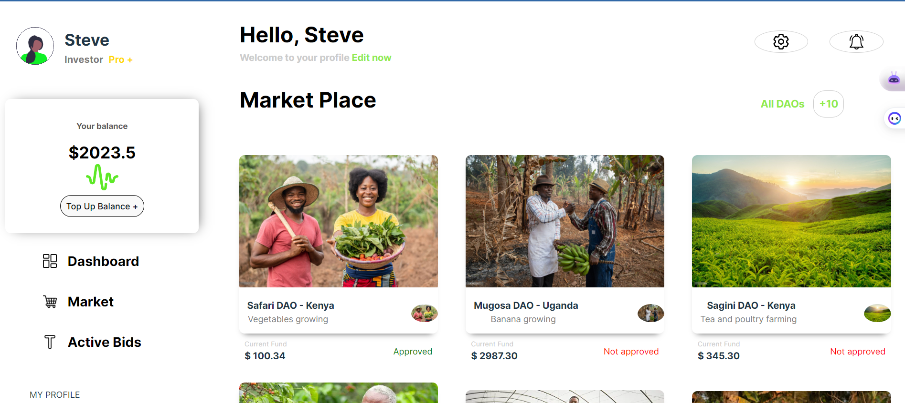

## Follow the steps
* Switch to ```new-dahsboard``` branch using the command ```git checkout new-dahsboard```

* Main components of the new dashboard design are in the ```DashboardComponents``` folder which is located using the filepath url: `new-frontend\src\components\DashboardComponents`

### DashboardComponents: 
Inside DashboardComponets you'll find 2 folders: 
* MainBar 
* SideBar 

#### MainBar
This is the UI design of the MainBar: 
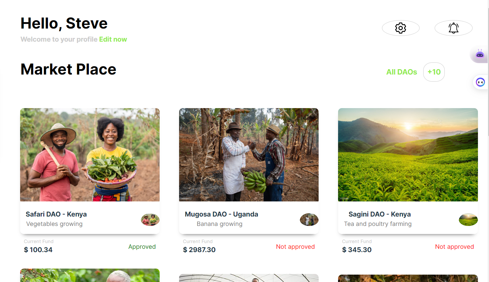

It has two sections: 
* TopSection: 
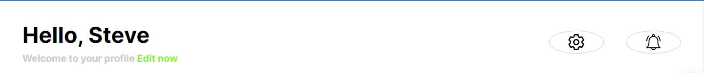

* Marketplace: 
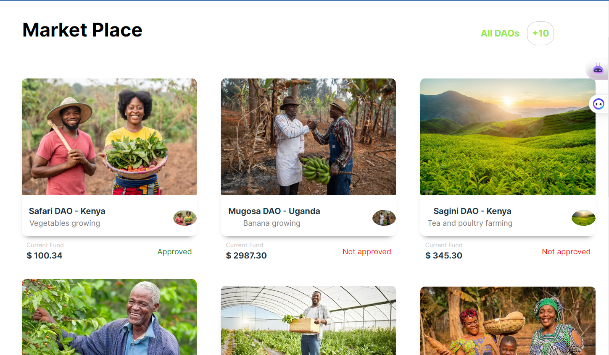

* Marketplace has two components: 
1. MarketplaceHeader: 
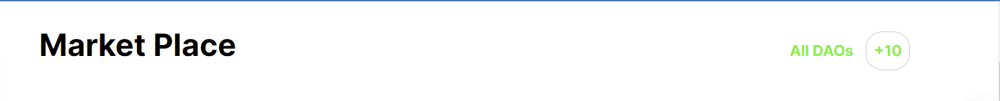

2. MarketplaceDAOs: 
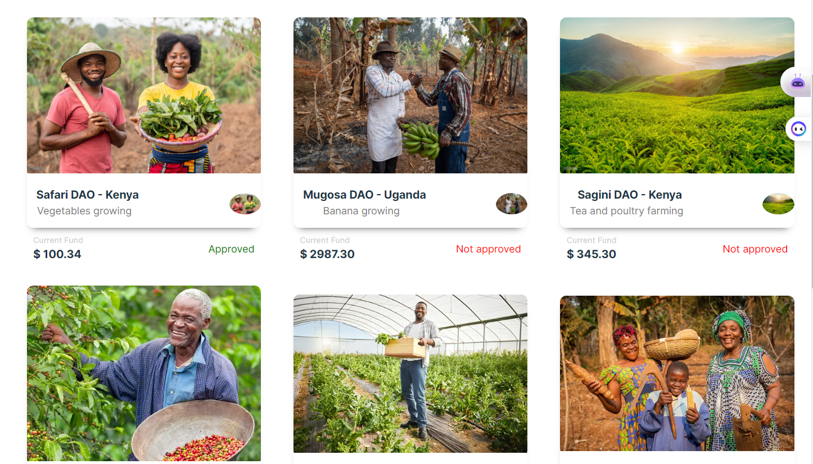 

#### SideBar
This is the UI design of the SideBar: 

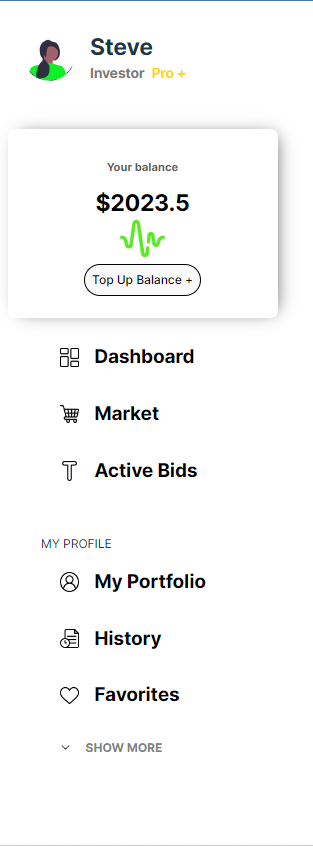

It has 3 sections 
* Profile: 

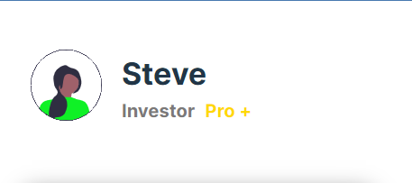

* Balance: 

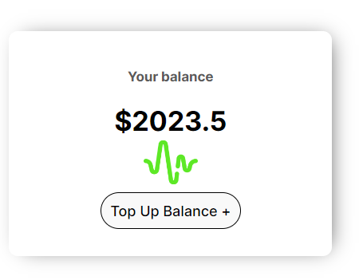

* NavigationSection: 

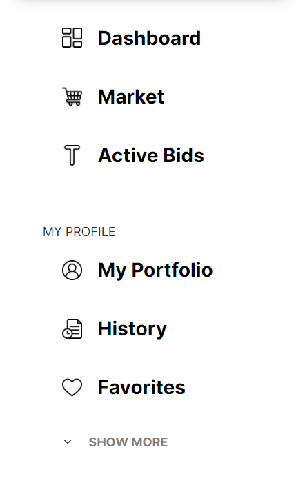

### To-do List: 
Note: The current design shows the Marketplace inside the Investor's dashboard. 

i.e when the Marketplace link is clicked/active 👇

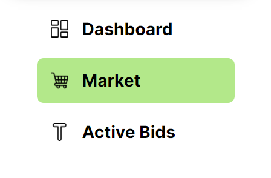
this is what appears on the right side of the Investor's UI: 


These are the pending tasks/To-Dos in the UI design: 

#### To-do instruction 1: Creation of InvestorDashboard (Joseph): 
This is what we are supposed to do: 
1. Creating a dashboard section for the investors. 

    i.e When the dashboard link is clicked/active: 

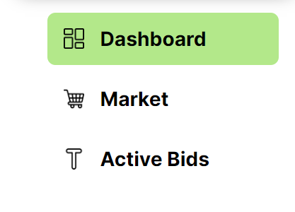 

    This is what should appear on the right side of the Investor's UI:

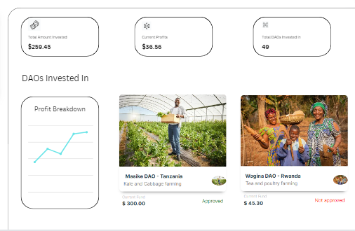 

##### Steps to follow: 
The component to be edited is `MainBar` component inside the `DashboardComponents`. This is the filepath url: `new-frontend\src\components\DashboardComponents\MainBar`

* Create a new branch called `main-bar-investor-dashboard`
* Create a new component named `MainBarInvestorDashboard` It should contain a UI that looks like this 👇: 
  
* Import the just created `MainBarInvestorDashboard` component in the `InvestorDashboard` component inside the `DashboardComponents` folder. Filepath URL: `new-frontend\src\components\DashboardComponents\InvestorDashboard\` 

   This is the code in the `InvestorDashboard.jsx` component (The comments contain the changes to be made): 
   ```
   const InvestorDashboard = () => {
        return (
            <div className='investordashboard-container'>
                <Sidebar /> 
                <MainBar /> // Comment out this component 
                <MainBarInvestorDashboard> // Insert the newly created component here
            </div>
        )
    }
  ``` 

  This is the UI that should be seen in the InvestorDashboard 👇: 
  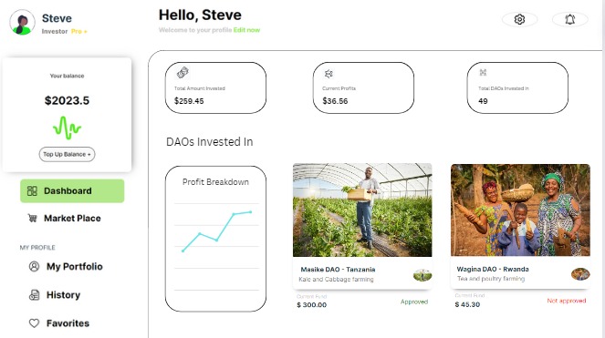 

Complete UI design can be found over [here](https://www.canva.com/design/DAFt2v6de44/POF8I8k2bRdIuv-zfyKZXw/edit?utm_content=DAFt2v6de44&utm_campaign=designshare&utm_medium=link2&utm_source=sharebutton) 

#### To-do instruction 2: Creation of FarmerDashboard (Steve): 
We are supposed to create a new dashboard for the farmers

##### Steps to follow: 
Create a new branch called `main-bar-farmers-dashboard`
The components to be edited are: 
1. `Sidebar` and `Mainbar` inside the `DashboardComponents` folder. This is the filepath url: `frontend\src\components\DashboardComponents`
2. `FarmerDashboard` component inside the `components` folder. This is the filepath url: `frontend\src\components\FarmerDashboard`  

###### Sidebar:
Add a prop that would allow to switch between investors dashboard and farmers dashboard 

###### Mainbar:
Add a prop that would allow to switch between investors dashboard and farmers dashboard

###### FarmerDashboard:
Check instructions in the comments below

```
// Import Sidebar and Mainbar 
// Add the props 
const FarmerDashboard = () => {
  return (
    <div>
      FarmerDashboard
    </div>
  )
}
```

This is the final design that should be seen in the Farmer's Dashboard 👇: 
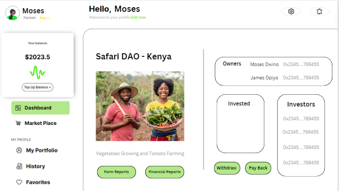 


